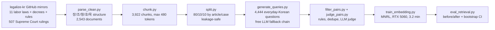

# 근로 Q&A 도메인 적응 — Fine-Tuning a Korean Embedding Model for Labor-Law Retrieval

Fine-tuning an open Korean embedding model so that **everyday questions from workers** retrieve the
**correct statute article or Supreme Court ruling**, with an honest before/after measurement.

> **This is a portfolio research project, not legal advice.**
> **본 프로젝트는 포트폴리오용 연구 프로젝트이며 법률 자문이 아닙니다.**

---

## Headline result

Fine-tuning `intfloat/multilingual-e5-base` on 3,631 synthetic labor-law question/article pairs
raised **Recall@1 from 0.513 to 0.657 (+28.1% relative)** and **NDCG@10 from 0.711 to 0.815**
on 335 held-out questions, with non-overlapping 95% confidence intervals.
Training cost **3.2 minutes on one consumer GPU (RTX 5060, 6.3 GB peak)** and **zero dollars** —
every model, dataset and API used is free-tier or open-weight.

**한 줄 요약:** 일반인의 구어체 노동법 질문에 대해 한국어 임베딩 모델을 도메인 적응시켜
Recall@1을 0.513 → 0.657 (상대 +28.1%)로 향상시켰으며, 전 과정을 무료 자원으로 재현 가능하게 구성했습니다.

### Retrieval on 335 held-out test questions (3,922-chunk corpus, 95% bootstrap CI)

| System | Recall@1 | Recall@5 | Recall@10 | MRR@10 | NDCG@10 |
|---|---|---|---|---|---|
| BM25 (Kiwi morphemes) | 0.478 [0.427–0.531] | 0.767 | 0.827 [0.785–0.869] | 0.601 | 0.656 [0.617–0.696] |
| multilingual-e5-base (off-the-shelf) | 0.513 [0.460–0.567] | 0.824 | 0.904 [0.872–0.934] | 0.649 | 0.711 [0.676–0.747] |
| **e5-base fine-tuned (this work)** | **0.657 [0.606–0.707]** | **0.925** | **0.952 [0.928–0.973]** | **0.769** | **0.815 [0.785–0.847]** |
| Hybrid RRF (BM25 + fine-tuned) | 0.606 [0.552–0.657] | 0.866 | 0.922 [0.892–0.949] | 0.720 | 0.769 [0.735–0.804] |

Reproduce: `python src/eval_retrieval.py --model models/e5-base-labor-law --name "e5-base FINE-TUNED"`
Raw numbers: [results/phase4_baselines/metrics.json](results/phase4_baselines/metrics.json) ·
chart: [comparison.png](results/phase4_baselines/comparison.png)

**Two findings worth noting:**
1. The fine-tuned dense model **beats hybrid BM25+dense retrieval**. Domain adaptation closed the
   vocabulary gap that keyword search was compensating for, so fusing with BM25 now *hurts*.
2. The gain is largest at **Recall@1** (+14.4 points) — exactly the metric a RAG system depends on,
   since the top result dominates what the generator sees.

---

## The problem

Korean workers do not ask questions in legal language:

| A worker asks | The statute says |
|---|---|
| "작년에 안 준 알바비 지금이라도 받을 수 있나요?" | 근로기준법 제49조 — 임금채권은 3년간 행사하지 아니하면 시효로 소멸한다 |
| "5인 미만 가게인데 연차 있어요?" | 근로기준법 시행령 제7조의2 — 상시 사용하는 근로자 수의 산정 방법 |
| "퇴근길에 슈퍼 들렀다 사고 났는데 산재 되나요?" | 산재보험법 시행령 제35조 — 출퇴근 중의 사고 |

For the first example, BM25 ranked the correct article **3,885th**. This vocabulary gap between
everyday Korean and legal Korean is the problem this project measures and closes.

---

## Pipeline



### Data
- **Source:** [legalize-kr/legalize-kr](https://github.com/legalize-kr/legalize-kr) (commit `3969940`)
  and [legalize-kr/precedent-kr](https://github.com/legalize-kr/precedent-kr) (commit `e33b0de`),
  both generated from the official 법제처 국가법령정보 OpenAPI.
- Statutes and judgments are **excluded from copyright** under 저작권법 제7조.
- **Law snapshot: 2026-09-25.** Each file is pinned to the version *in force* on that date by
  walking its commit history — 7 of 33 files had amendments promulgated but not yet effective
  (근로기준법 HEAD takes effect 2027-06-10).

| doc_type | Documents | Chunks |
|---|---|---|
| law (법률) | 843 | 939 |
| decree (시행령) | 736 | 885 |
| rule (시행규칙) | 457 | 526 |
| precedent (대법원 2008+) | 507 | 1,572 |
| **total** | **2,543** | **3,922** |

### Training data
4,444 questions generated from chunk text by free-tier LLMs, written in the voice of 알바생,
정규직, 계약직, 사장님, 육아휴직 예정자 and others, with instructions to avoid legal vocabulary.
Filtered by rules (length, non-Korean, copied article numbers), near-duplicate detection, and an
**LLM-as-judge** answerability check. Final training set: **3,631 pairs**.

### Training
`CachedMultipleNegativesRankingLoss`, batch 64 (mini-batch 8), lr 2e-5, 2 epochs, fp16,
`NO_DUPLICATES` sampler, e5 `query:`/`passage:` prefixes at train *and* eval time, seed 42.

---

## Verifying the result is real

A +28% jump deserves scrutiny, so the repo contains the audit:

```bash
python src/check_leakage.py
```

| Check | Result |
|---|---|
| No article/case shared between train and test | PASS |
| No shared chunk id | PASS |
| No near-duplicate questions across splits | PASS |
| All test queries belong to the test split | PASS |
| No identical chunk text across splits | **FAIL — 2 found, see below** |

The audit found that the upstream repo stores one judgment (2018다260602) **twice under different
판례일련번호**, so identical text reached both splits. Those **2 of 337** queries are excluded from
all reported metrics (`--keep-leaked` disables this). Their effect was negligible: Recall@1 moved
0.516 → 0.513 for the baseline and 0.659 → 0.657 for the fine-tuned model.

Splits are made **by article/case, not by chunk**, so every 항-split of one article and every
chunk of one ruling stay in the same split.

---

## Limitations (read before citing any number)

1. **The test set is synthetic and not human-verified.** Questions were LLM-generated from the test
   chunks; the planned human review of 200 + 50 self-written questions was not run. Before/after
   comparison remains valid — every system sees the identical query set — but absolute values may
   be optimistic relative to real user questions.
2. **Judge coverage is partial.** 1,626 of 4,102 train/val pairs were judged before free quotas
   made further judging impractical; the judge rejected only **2.9%** (47/1,626), so the remaining
   pairs were kept and flagged `judge_verdict: null`.
3. **Mixed judge models.** Free per-model daily quotas forced a chain of 5 judges. Each was
   calibrated on the same 30 items (20 hand-labelled + 10 deliberately mismatched controls):
   Gemini 28/30, Groq 27/30, NVIDIA Nemotron 27/30, all rejecting 10/10 controls. All three
   disagreed on the *same 3 borderline items*, which suggests genuine ambiguity rather than error.
   Every judgment records its model.
4. **Hand-labels are mine, not a lawyer's.** Calibration labels were produced by reading the
   statute text, not by a legal professional.
5. **No generation track yet.** Track B (QLoRA answer generation with citations and refusal) and
   the end-to-end 2×2 comparison are not implemented.
6. **Annex tables (별표) are missing** — upstream provides them only as PDF/HWP. This notably omits
   근로기준법 시행령 별표1, the list of provisions applying to workplaces with fewer than 5 employees.
7. **Laws change.** Results describe the corpus as of the 2026-09-25 snapshot.
8. **Not legal advice.**

---

## Engineering notes

Problems found and fixed during the build, each recorded in
[docs/decisions_log.md](docs/decisions_log.md) (43 entries):

- **Future law text.** The mirror stores the latest *promulgated* version, not the one in force.
  Fixed by walking each file's git history to the version effective on the snapshot date.
- **Deterministic LLM failure loops.** A fixed seed made one model reproduce the same
  repetition-to-`MAX_TOKENS` failure on every retry. Fixed with a new seed per attempt plus an
  output cap and finish-reason check.
- **Quota misclassification.** Gemini and Groq both report quota exhaustion as HTTP 429.
  Measured the real ceilings by provoking each error: Gemini flash models allow **20 requests/day**
  and state a misleading 18s retry; Groq allows **200,000 tokens/day** on a rolling window and
  states a true 21-minute retry. The client now reads each provider's signal and benches models
  accordingly, persisting benches across restarts.
- **Silent YAML boolean.** `keep_verdicts: [yes]` parsed as `[True]`, so every judged pair was
  dropped. Fixed and guarded with a startup assertion.
- **Tokenizer normalisation damage.** Decoding token windows turned `②` into `2`; chunk splitting
  now slices the original text by token offsets.
- **A filter that would have removed the signal.** The planned round-trip filter (keep a pair only
  if a baseline retriever already ranks it top-20) was discarded after manual inspection showed
  **19 of 20** rejected pairs were correct — they were precisely the vocabulary-gap examples the
  project exists to learn. Round-trip rank is now recorded, not enforced.

---

## Reproduce

```powershell
uv venv .venv --python 3.11
uv pip install --python .venv\Scripts\python.exe -r requirements.txt
# GPU (RTX 50-series needs CUDA >= 12.8):
#   uv pip install --python .venv\Scripts\python.exe torch==2.11.0 --index-url https://download.pytorch.org/whl/cu128

.venv\Scripts\python.exe src\collect.py          # clone mirrors -> data/raw/
.venv\Scripts\python.exe src\parse_clean.py      # -> data/processed/documents.jsonl
.venv\Scripts\python.exe src\chunk.py            # -> data/processed/chunks.jsonl
.venv\Scripts\python.exe src\split.py            # -> data/processed/splits.json
.venv\Scripts\python.exe src\generate_queries.py # needs GEMINI_API_KEY in .env; resumable
.venv\Scripts\python.exe src\filter_pairs.py
.venv\Scripts\python.exe src\judge_pairs.py --calibrate
.venv\Scripts\python.exe src\judge_pairs.py      # resumable; --finalize to stop early
.venv\Scripts\python.exe src\check_leakage.py
.venv\Scripts\python.exe src\train_embedding.py  # 3.2 min on RTX 5060
.venv\Scripts\python.exe src\eval_retrieval.py --model models\e5-base-labor-law --name "e5-base FINE-TUNED"
```

API keys go in `.env` (gitignored): `GEMINI_API_KEY`, optionally `GROQ_API_KEY`, `NVIDIA_API_KEY`.
Models whose key is missing are skipped automatically.

## Compute used

All free. Data collection, filtering, training and evaluation run on one desktop
(Ryzen 5 7500F, RTX 5060 8 GB). Fine-tuning: **3.2 GPU-minutes**, 6.31 GB peak.
Question generation and judging used free API tiers (Google AI Studio, Groq, NVIDIA NIM).

## Licenses

| Component | License |
|---|---|
| `intfloat/multilingual-e5-base` | MIT |
| Statute and judgment text | Public domain (저작권법 제7조) |
| legalize-kr repo structure/metadata | MIT (stated in their READMEs; no LICENSE file present) |
| This code | MIT |

## Status

Phases 0–5 complete (data → chunking → query generation → filtering → embedding fine-tuning →
evaluation). Not yet done: human-verified test set, hard-negative mining, Track B QLoRA
generation, end-to-end RAG comparison, Hugging Face publication, Gradio demo.
